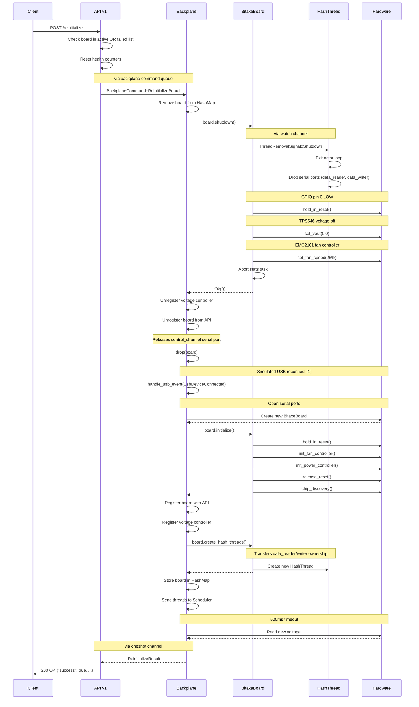
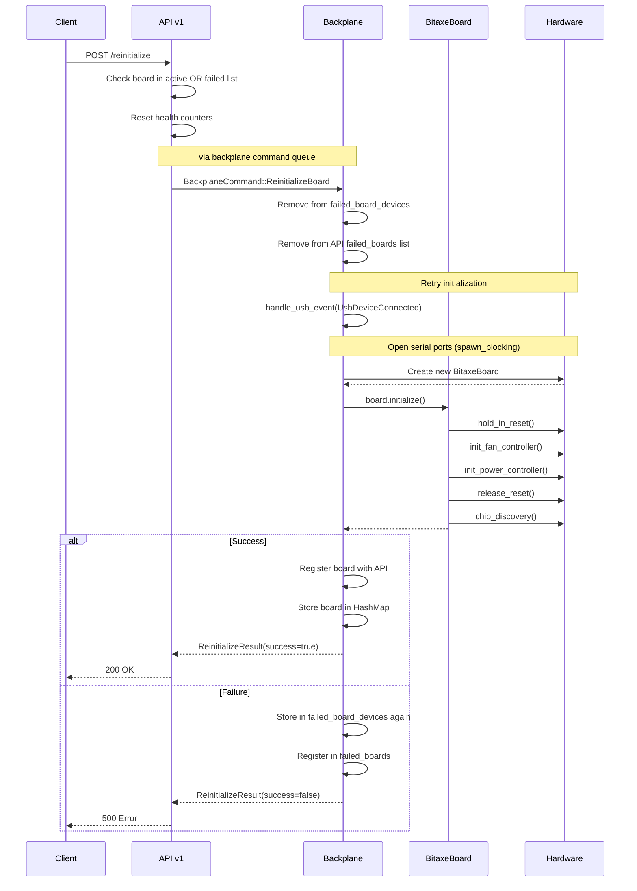

`set_vout` API Implementation

This document describes the implementation of dynamic voltage control for Bitaxe boards through the mujina-miner HTTP API.

## 1. New API Endpoint

**Endpoint:** `POST /api/v1/board/:serial/voltage`

**Parameters:**
- `:serial` - Board serial number in URL path

**Request Body:**
```json
{
  "voltage": 1.2
}
```
*Voltage value in volts (float)*

**Response:**
```json
{
  "success": true,
  "requested_voltage": 1.2,
  "actual_voltage": 1.199,
  "message": "Voltage set to 1.200V (readback: 1.199V)"
}
```

## 2. Key Features

### 2.1. Voltage Setting
- Uses `tps546.set_vout()` to change the TPS546D24A voltage regulator output
- Supports any voltage within the configured safe operating range

### 2.2. Stabilization Wait
- Waits 500ms for voltage to stabilize after setting
- Ensures stable voltage before verification

### 2.3. Verification
- Reads back actual voltage with `tps546.get_vout()` to confirm
- Reports both requested and actual voltage in response

### 2.4. Safety Checks

The implementation includes multiple layers of safety validation:

1. **API-level validation** - Rejects voltages outside 0.5V - 2.0V range
2. **TPS546 driver validation** - Validates against configured `VOUT_MIN`/`VOUT_MAX`
3. **Hardware protection limits** - OV/UV fault detection at the hardware level

## 3. Architecture Changes

### 3.1. [v1.rs](../mujina-miner/src/api/v1.rs)

**Lines 21-52:** Added `AppState` structure
- Registry of voltage controllers by board serial number
- Methods to register/unregister controllers

**Lines 54-93:** Added request/response types
- `SetVoltageRequest` - API request payload
- `SetVoltageResponse` - API response with readback
- `ErrorResponse` - Error handling

**Lines 111-232:** Implemented `set_board_voltage()` handler
- Validates voltage range
- Looks up voltage controller by serial number
- Calls `set_vout()` and waits for stabilization
- Reads back actual voltage
- Full error handling with detailed messages

### 3.2. [api/mod.rs](../mujina-miner/src/api/mod.rs)

**Line 13:** Re-exported `AppState` for daemon usage

**Line 40:** Updated `serve()` to accept `AppState` parameter

**Lines 68-74:** Updated `build_router()` to pass state to routes

### 3.3. [daemon.rs](../mujina-miner/src/daemon.rs)

**Line 39:** Creates `AppState` instance at daemon startup

**Line 53:** Passes `AppState` to backplane for board registration

**Line 148:** Passes `AppState` to API server

### 3.4. [backplane.rs](../mujina-miner/src/backplane.rs)

**Line 9:** Imports `AppState` from API module

**Lines 42-51:** Added `api_state` field to `Backplane` struct

**Lines 55-67:** Updated constructor to accept `AppState`

**Lines 148-161:** Board registration logic
- Downcasts to `BitaxeBoard` if applicable
- Retrieves voltage regulator handle
- Registers with API state

**Line 221:** Unregisters voltage controller on board disconnect

### 3.5. [board/mod.rs](../mujina-miner/src/board/mod.rs)

**Line 16:** Updated `Board` trait to require `AsAny`

**Lines 38-40:** Added `AsAny` helper trait
- Enables downcasting of trait objects
- Required for board-specific feature detection

### 3.6. [bitaxe.rs](../mujina-miner/src/board/bitaxe.rs)

**Lines 149-156:** Added `get_voltage_regulator()` method
- Returns cloned `Arc<Mutex<Tps546>>` for API access
- Allows dynamic voltage control without board ownership

**Lines 817-821:** Implemented `AsAny` trait
- Enables downcast from `Box<dyn Board>` to concrete type

### 3.7. [emberone.rs](../mujina-miner/src/board/emberone.rs)

**Lines 28-32:** Implemented `AsAny` trait for compatibility
- Required for trait object downcasting
- No voltage controller registered (board lacks hardware)

## 4. Usage Example

### 4.1. Set Voltage

```bash
# Set voltage to 1.2V on a board with serial ABC123
curl -X POST http://localhost:7785/api/v1/board/ABC123/voltage \
  -H "Content-Type: application/json" \
  -d '{"voltage": 1.2}'
```

### 4.2. Success Response

```json
{
  "success": true,
  "requested_voltage": 1.2,
  "actual_voltage": 1.199,
  "message": "Voltage set to 1.200V (readback: 1.199V)"
}
```

### 4.3. Error Responses

**Board Not Found:**
```json
{
  "error": "Board with serial 'ABC123' not found or does not support voltage control"
}
```

**Voltage Out of Range:**
```json
{
  "error": "Voltage 2.5 is outside safe range (0.5V - 2.0V)"
}
```

**Hardware Failure:**
```json
{
  "success": false,
  "requested_voltage": 1.2,
  "actual_voltage": null,
  "message": "Failed to set voltage: Voltage out of range: 1.20V (min: 0.80V, max: 1.20V)"
}
```

## 5. Design Decisions

### 5.1. Alternative Approach: Board Trait Method

An alternative implementation would add voltage control directly to the `Board` trait:

```rust
#[async_trait]
pub trait Board: Send {
    fn board_info(&self) -> BoardInfo;
    async fn shutdown(&mut self) -> Result<(), BoardError>;
    async fn create_hash_threads(&mut self) -> Result<Vec<Box<dyn HashThread>>, BoardError>;

    // New method
    async fn set_voltage(&mut self, voltage: f32) -> Result<f32, BoardError>;
}
```

### 5.2. Why This Was Not Selected

**1. Not All Boards Support Voltage Control**

The `EmberOne` board lacks a voltage regulator and would need to return an error:

```rust
impl Board for EmberOne {
    async fn set_voltage(&mut self, voltage: f32) -> Result<f32, BoardError> {
        Err(BoardError::HardwareControl("Voltage control not supported".into()))
    }
}
```

This violates the Interface Segregation Principle by forcing boards to implement features they don't support.

**2. Board Trait Ownership Issues**

The backplane owns boards as `HashMap<String, Box<dyn Board + Send>>`. The Board trait requires `&mut self` for most operations, creating complex locking scenarios:

- API needs mutable access to call `set_voltage(&mut self)`
- Backplane already owns the board
- Would require exposing entire Board through shared mutable state

**3. Violates Single Responsibility Principle**

The `Board` trait's purpose is **board lifecycle management** (init, shutdown, thread creation). Adding runtime control operations mixes concerns:

- **Lifecycle operations**: `shutdown()`, `create_hash_threads()` (one-time)
- **Runtime operations**: `set_voltage()`, `set_frequency()`, `get_temperature()` (continuous)

**4. Would Require Complex Shared Ownership**

```rust
pub struct Backplane {
    // Would need Arc<Mutex<Box<dyn Board>>> to share mutably
    boards: Arc<RwLock<HashMap<String, Arc<Mutex<Box<dyn Board + Send>>>>>>,
}
```

This creates contention between API calls and board lifecycle operations.

### 5.3. Why the Selected Approach Is Better

**1. Separation of Concerns**

The selected approach cleanly separates:
- **Board lifecycle**: Managed by the `Board` trait and backplane
- **Runtime control**: Handled through dedicated controller handles (`Arc<Mutex<Tps546>>`)

**2. Optional Feature Pattern**

Only boards with voltage controllers register them:

```rust
if let Some(bitaxe_board) = board.as_any().downcast_ref::<BitaxeBoard>() {
    if let Some(regulator) = bitaxe_board.get_voltage_regulator() {
        api_state.register_voltage_controller(serial, regulator).await;
    }
}
```

Boards without voltage control simply don't register - no stub implementations needed.

**3. Fine-Grained Locking**

The API directly accesses the TPS546 controller through its own `Arc<Mutex>`:

```rust
let controller = controllers.get(&serial)?.clone();
let mut tps546 = controller.lock().await;
tps546.set_vout(voltage).await?;
```

This only locks the voltage controller, not the entire board. Other operations (fan control, temperature monitoring) can continue concurrently.

**4. Extensibility**

Adding more runtime controls follows the same pattern:

```rust
pub struct AppState {
    pub voltage_controllers: Arc<RwLock<HashMap<String, VoltageControllerHandle>>>,
    pub fan_controllers: Arc<RwLock<HashMap<String, FanControllerHandle>>>,
    pub frequency_controllers: Arc<RwLock<HashMap<String, FrequencyControllerHandle>>>,
}
```

Each controller is independently accessible without mixing concerns in the Board trait.

**5. Proven Pattern**

The Bitaxe board already shares the voltage regulator with hash threads using `Arc<Mutex<Tps546>>`. The API implementation extends this existing pattern rather than introducing a new architecture.

## 6. Trade-off Analysis

| Aspect | Trait Method | Controller Registry (Selected) |
|--------|--------------|-------------------------------|
| **Simplicity** | ❌ Simpler conceptually | ✅ More components but cleaner separation |
| **Board Support** | ❌ All boards need stub implementations | ✅ Only capable boards register |
| **Locking Granularity** | ❌ Locks entire board | ✅ Locks only the controller |
| **Type Safety** | ✅ Compile-time guarantee | ⚠️ Runtime downcast (type-safe) |
| **Extensibility** | ❌ Trait bloat | ✅ Easy to add more controllers |
| **Performance** | ❌ Potential contention | ✅ Fine-grained locking |

The selected approach trades slightly more initial setup complexity for better long-term maintainability, performance, and extensibility.


## 7. Reinitialize API

**Endpoint:**
```
POST /api/v1/board/{serial}/reinitialize
```

**Supports both:**
- Active boards (in `Backplane.boards`) - shuts down first, then reinitializes
- Failed boards (in `Backplane.failed_board_devices`) - directly attempts reinitialization

**Response:**
```json
{
  "success": true,
  "message": "Board '71bfd369' successfully reinitialized",
  "previous_error": "I2C error: WriteRead failed: Response ID mismatch",
  "current_voltage": 1.2
}
```

**Error Response (board not found):**
```json
{
  "error": "Board with serial '71bfd369' not found"
}
```

### 7.1. Sequence Diagram (Active Board)

The following diagram shows reinitialization of an **active** board.



### 7.2. Sequence Diagram (Failed Board)

Reinitialization of a **failed** board skips shutdown steps since the board never
fully initialized.



* [1] Simulated USB reconnect: No physical USB disconnect occurs. The software invokes handle_usb_event(UsbDeviceConnected) to reuse the standard board initialization path. The prior drop(board) releases the serial port, allowing the "reconnected" board to reopen it.

### 7.3. Key Components

| Component | Location | Role |
|-----------|----------|------|
| API v1 | `api/v1.rs` | HTTP endpoint handler, validates request, sends command to backplane |
| Backplane | `backplane.rs` | Orchestrates board lifecycle, owns board instances and failed_board_devices |
| BitaxeBoard | `board/bitaxe.rs` | Board abstraction, controls peripherals via control channel |
| HashThread | `asic/bm13xx/thread.rs` | ASIC communication actor, owns data serial ports |
| Hardware | Physical | TPS546 (voltage), EMC2101 (fan), GPIO (reset), serial ports |

### 7.4. Data Structures

| Structure | Location | Purpose |
|-----------|----------|---------|
| `Backplane.boards` | backplane.rs | Active, successfully initialized boards |
| `Backplane.board_devices` | backplane.rs | UsbDeviceInfo for active boards (for reinit) |
| `Backplane.failed_board_devices` | backplane.rs | UsbDeviceInfo for failed boards (for reinit) |
| `AppState.failed_boards` | api/v1.rs | Failed board status visible via REST API |
| `AppState.board_init_timeout` | api/v1.rs | Timeout read from env at startup |

### 7.5. Communication Channels

| Channel Type | Purpose |
|--------------|---------|
| `mpsc` | API → Backplane commands (BackplaneCommand enum) |
| `oneshot` | Backplane → API response (ReinitializeResult) |
| `watch` | Board → HashThread shutdown signal (ThreadRemovalSignal) |
| Serial (control) | Board → ESP32 → I2C peripherals |
| Serial (data) | HashThread → ESP32 → BM1370 ASIC |

### 7.6. Critical Timing

The `drop(board)` call before `handle_usb_event` is essential for active board
reinitialization. The old board holds the control channel serial port (`/dev/ttyACMx`).
If not explicitly dropped before reprobing, the new board creation fails with
"Device or resource busy" because the OS still sees the port as open.

For failed boards, the initialization task is aborted and we wait 100ms after
abort to ensure the OS releases serial port handles.
