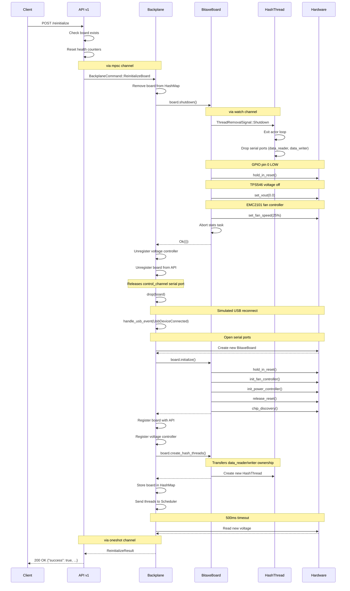

# Bitaxe Gamma Board Support

This document describes mujina-miner's support for the Bitaxe Gamma board.

## Overview

The [Bitaxe Gamma](https://github.com/bitaxeorg/bitaxegamma) is an open-source Bitcoin
mining board featuring a single BM1370 ASIC chip (from Antminer S21 Pro) and
an ESP32-S3 microcontroller. The board connects to mujina-miner via USB and
provides on-board power management and thermal control.

## Firmware Requirements

**The Bitaxe Gamma must be running the
[bitaxe-raw](https://github.com/bitaxeorg/bitaxe-raw) firmware to work with
mujina-miner.** This firmware exposes a dual-port USB serial interface that
allows direct control of the board's peripherals and ASIC communication.

See the [bitaxe-raw flashing
instructions](https://github.com/bitaxeorg/bitaxe-raw#flashing) to install
the required firmware on your board.

## Board Architecture

The board presents two USB CDC ACM serial ports when connected:
- `/dev/ttyACM0` - Control channel for board management (power, thermal, GPIO)
- `/dev/ttyACM1` - Data channel for direct ASIC communication

The control channel uses the bitaxe-raw protocol to tunnel I2C, GPIO, and ADC
operations over USB, allowing mujina-miner to manage board peripherals without
custom kernel drivers.

## Hardware Components

- **BM1370 ASIC**: Single chip capable of approximately 640 GH/s
- **TPS546D24A**: PMBus-compatible power management IC for core voltage control
- **EMC2101**: PWM fan controller with integrated temperature monitoring

Implementation details for these components are in the board and peripheral
modules.

## I2C Communication and Timeout Handling

### Problem

The TPS546D24A voltage regulator is accessed via I2C through the bitaxe-raw
protocol over USB serial. In rare cases, I2C communication can hang
indefinitely due to:

- USB connection issues
- Firmware bugs in bitaxe-raw
- Hardware faults on the I2C bus
- Board power issues

When the board monitoring thread holds a lock on the voltage controller and
encounters a hung I2C operation, it blocks indefinitely. This prevents the REST
API from accessing the same controller to read board status, causing API
requests (like `GET /api/v1/boards`) to hang and never return.

### Solution

All I2C operations that acquire locks on shared resources (voltage controllers,
fan controllers) now use 500ms timeouts:

```rust
match tokio::time::timeout(
    Duration::from_millis(500),
    async { controller.lock().await.get_vout().await }
).await {
    Ok(Ok(value)) => { /* success */ }
    Ok(Err(e)) => { /* I2C error */ }
    Err(_) => { /* timeout - I2C hung */ }
}
```

This ensures:
- Locks are released promptly even if I2C hangs
- The REST API remains responsive (returns within ~500ms)
- Warning messages are logged when timeouts occur
- Board monitoring continues despite communication failures

### Affected Operations

Timeout protection is applied to:

**Board monitoring thread** (runs every 30 seconds):
- Voltage regulator reads: VIN, VOUT, IOUT, power, temperature
- Status checks and fault clearing
- Fan controller operations

**REST API endpoints**:
- `GET /api/v1/boards` - board voltage reads
- `POST /api/v1/board/{serial}/voltage` - voltage set operations

### Diagnostics

When I2C communication issues occur, you'll see warnings in the logs:

```
WARN Timeout reading VOUT (I2C may be hung)
WARN Timeout reading voltage for board serial=ABC12345 (I2C may be hung)
```

If you see these warnings persistently, check:
1. USB cable connection
2. Board power supply
3. bitaxe-raw firmware version
4. USB host controller stability

## Board Auto-Recovery (Future Enhancement)

### Summary
Automatic recovery for boards experiencing I2C communication failures, with configurable retry parameters via environment variables.

### Background
Currently, when a board experiences persistent I2C failures (e.g., due to USB issues, firmware bugs, or hardware faults), it remains in a degraded state with error messages but requires manual intervention to recover. This feature adds automatic recovery capability with manual override.

### Configuration (Environment Variables)
```bash
# Number of consecutive failures before marking board as needing recovery
MUJINA_BOARD_FAILURE_THRESHOLD=3  # Default: 3

# Number of automatic retry attempts before giving up
MUJINA_BOARD_MAX_AUTO_RETRIES=3  # Default: 3

# Duration between automatic retry attempts (seconds)
MUJINA_BOARD_RETRY_INTERVAL=30  # Default: 30

# Enable/disable automatic recovery (if false, manual only)
MUJINA_BOARD_AUTO_RECOVERY=false  # Default: false
```

### API Changes

**Extended BoardStatus Schema:**
```rust
pub struct BoardStatus {
    // ... existing fields ...
    pub error: Option<String>,           // Already implemented
    pub needs_reinit: bool,               // NEW: true when consecutive_failures >= threshold
    pub consecutive_failures: u32,        // NEW: failure counter
    pub retry_count: u32,                 // NEW: auto-retry counter
}
```

**New Endpoint:**
```
POST /api/v1/board/{serial}/reinitialize
```

Response:
```json
{
  "success": true,
  "message": "Board reinitialized successfully",
  "previous_error": "I2C error: WriteRead failed: Response ID mismatch",
  "current_voltage": 1.2
}
```

### Implementation Details

**State Tracking:**
- Add `HashMap<String, BoardHealthState>` to `AppState`
- Track per-board: consecutive failures, last failure time, retry count, last retry time

**Recovery Scope:**
- Fully re-probe board (same as initial discovery)
- Kill and restart monitoring thread
- Reset failure counters on success

**Monitoring Thread Changes:**
1. On I2C failure: increment consecutive failure counter
2. When counter >= threshold: set `needs_reinit = true` in board status
3. If auto-recovery enabled AND retry interval elapsed AND retry_count < max_retries:
   - Log warning: "Attempting automatic board recovery"
   - Trigger reinitialization
   - Increment retry_count
4. On successful read: reset counters

**Logging (all at WARN level):**
- "Board marked as needing recovery: serial={serial}, consecutive_failures={count}"
- "Attempting automatic board recovery: serial={serial}, attempt={retry_count}/{max_retries}"
- "Board recovery successful: serial={serial}"
- "Board recovery failed: serial={serial}, error={error}"

**Thread Safety:**
- Kill existing monitoring thread for the board during reinit
- Create new thread after successful reinitialization
- Use proper synchronization to prevent concurrent reinit attempts

### Success Criteria
- Environment variables correctly configure retry behavior
- Failure counter increments on I2C errors, resets on success
- `needs_reinit` flag appears in API response when threshold reached
- Manual reinit endpoint works and returns appropriate response
- Auto-recovery triggers at configured interval when enabled
- Auto-recovery stops after max_retries attempts
- All logging events emit at WARN level with structured fields
- Board fully reprobes (voltage controller + fan controller + monitoring thread)
- Old monitoring thread cleanly terminates before new one starts
- Swagger UI documents the new endpoint and schema fields

### Non-Goals (Explicitly Out of Scope)
- Metrics/telemetry tracking
- Per-board retry configuration (global only)
- Partial reinitialization (always full reprobe)
- Recovery success rate tracking

## Reinitialize API Sequence Diagram

The following diagram shows the internal component interactions when the
`POST /api/v1/board/{serial}/reinitialize` endpoint is invoked.



### Key Components

| Component | Location | Role |
|-----------|----------|------|
| API v1 | `api/v1.rs` | HTTP endpoint handler, validates request, sends command to backplane |
| Backplane | `backplane.rs` | Orchestrates board lifecycle, owns board instances |
| BitaxeBoard | `board/bitaxe.rs` | Board abstraction, controls peripherals via control channel |
| HashThread | `asic/bm13xx/thread.rs` | ASIC communication actor, owns data serial ports |
| Hardware | Physical | TPS546 (voltage), EMC2101 (fan), GPIO (reset), serial ports |

### Communication Channels

| Channel Type | Purpose |
|--------------|---------|
| `mpsc` | API → Backplane commands (BackplaneCommand enum) |
| `oneshot` | Backplane → API response (ReinitializeResult) |
| `watch` | Board → HashThread shutdown signal (ThreadRemovalSignal) |
| Serial (control) | Board → ESP32 → I2C peripherals |
| Serial (data) | HashThread → ESP32 → BM1370 ASIC |

### Critical Timing

The `drop(board)` call before `handle_usb_event` is essential. The old board
holds the control channel serial port (`/dev/ttyACMx`). If not explicitly
dropped before reprobing, the new board creation fails with "Device or
resource busy" because the OS still sees the port as open.

## References

- [Bitaxe Project](https://bitaxe.org)
- [Bitaxe Gamma Hardware](https://github.com/bitaxeorg/bitaxeGamma)
- [bitaxe-raw Firmware](https://github.com/bitaxeorg/bitaxe-raw)
- [BM1370 Protocol Documentation](../asic/bm13xx/PROTOCOL.md)
