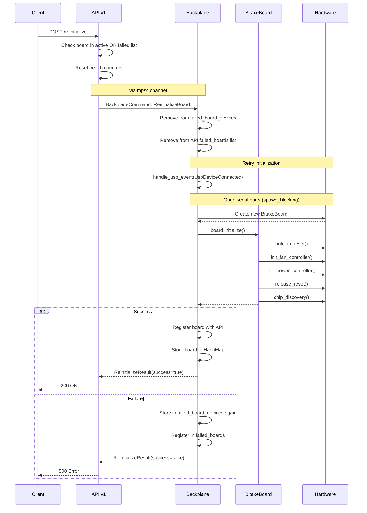

**Bitaxe Gamma Board Support**

This document describes mujina-miner's support for the Bitaxe Gamma board.

- [1. Overview](#1-overview)
- [2. Firmware Requirements](#2-firmware-requirements)
- [3. Board Architecture](#3-board-architecture)
- [4. Hardware Components](#4-hardware-components)
- [5. I2C Communication and Timeout Handling](#5-i2c-communication-and-timeout-handling)
  - [5.1. Problem](#51-problem)
  - [5.2. Solution](#52-solution)
  - [5.3. Affected Operations](#53-affected-operations)
  - [5.4. Diagnostics](#54-diagnostics)
- [6. Board Failure](#6-board-failure)
  - [6.1. Graceful Recovery](#61-graceful-recovery)
  - [6.2. Automatic Recovery](#62-automatic-recovery)
  - [6.3. Background](#63-background)
  - [6.4. Configuration (Environment Variables)](#64-configuration-environment-variables)
  - [6.5. API Changes](#65-api-changes)
  - [6.6. Implementation Details](#66-implementation-details)
  - [6.7. Success Criteria](#67-success-criteria)
  - [6.8. Non-Goals (Explicitly Out of Scope)](#68-non-goals-explicitly-out-of-scope)
- [7. Reinitialize API Sequence Diagram](#7-reinitialize-api-sequence-diagram)
  - [7.1. Key Components](#71-key-components)
  - [7.2. Communication Channels](#72-communication-channels)
  - [7.3. Critical Timing](#73-critical-timing)
- [8. References](#8-references)


## 1. Overview

The [Bitaxe Gamma](https://github.com/bitaxeorg/bitaxegamma) is an open-source Bitcoin
mining board featuring a single BM1370 ASIC chip (from Antminer S21 Pro) and
an ESP32-S3 microcontroller. The board connects to mujina-miner via USB and
provides on-board power management and thermal control.

## 2. Firmware Requirements

**The Bitaxe Gamma must be running the
[bitaxe-raw](https://github.com/bitaxeorg/bitaxe-raw) firmware to work with
mujina-miner.** This firmware exposes a dual-port USB serial interface that
allows direct control of the board's peripherals and ASIC communication.

See the [bitaxe-raw flashing
instructions](https://github.com/bitaxeorg/bitaxe-raw#flashing) to install
the required firmware on your board.

## 3. Board Architecture

The board presents two USB CDC ACM serial ports when connected:
- `/dev/ttyACM0` - Control channel for board management (power, thermal, GPIO)
- `/dev/ttyACM1` - Data channel for direct ASIC communication

The control channel uses the bitaxe-raw protocol to tunnel I2C, GPIO, and ADC
operations over USB, allowing mujina-miner to manage board peripherals without
custom kernel drivers.

## 4. Hardware Components

- **BM1370 ASIC**: Single chip capable of approximately 640 GH/s
- **TPS546D24A**: PMBus-compatible power management IC for core voltage control
- **EMC2101**: PWM fan controller with integrated temperature monitoring

Implementation details for these components are in the board and peripheral
modules.

## 5. I2C Communication and Timeout Handling

### 5.1. Problem

The TPS546D24A voltage regulator is accessed via I2C through the bitaxe-raw
protocol over USB serial. In rare cases, I2C communication can hang
indefinitely due to:

- USB connection issues
- Firmware bugs in bitaxe-raw
- Hardware faults on the I2C bus
- Board power issues

When the board monitoring thread holds a lock on the voltage controller and
encounters a hung I2C operation, it blocks indefinitely. This prevents the REST
API from accessing the same controller to read board status, causing API
requests (like `GET /api/v1/boards`) to hang and never return.

### 5.2. Solution

All I2C operations that acquire locks on shared resources (voltage controllers,
fan controllers) now use 500ms timeouts:

```rust
match tokio::time::timeout(
    Duration::from_millis(500),
    async { controller.lock().await.get_vout().await }
).await {
    Ok(Ok(value)) => { /* success */ }
    Ok(Err(e)) => { /* I2C error */ }
    Err(_) => { /* timeout - I2C hung */ }
}
```

This ensures:
- Locks are released promptly even if I2C hangs
- The REST API remains responsive (returns within ~500ms)
- Warning messages are logged when timeouts occur
- Board monitoring continues despite communication failures

### 5.3. Affected Operations

Timeout protection is applied to:

**Board monitoring thread** (runs every 30 seconds):
- Voltage regulator reads: VIN, VOUT, IOUT, power, temperature
- Status checks and fault clearing
- Fan controller operations

**REST API endpoints**:
- `GET /api/v1/boards` - board voltage reads
- `POST /api/v1/board/{serial}/voltage` - voltage set operations

### 5.4. Diagnostics

When I2C communication issues occur, you'll see warnings in the logs:

```
WARN Timeout reading VOUT (I2C may be hung)
WARN Timeout reading voltage for board serial=ABC12345 (I2C may be hung)
```

If you see these warnings persistently, check:
1. USB cable connection
2. Board power supply
3. bitaxe-raw firmware version
4. USB host controller stability

## 6. Board Failure and Recovery

### 6.1. Configuration

```bash
# Board initialization timeout in seconds (also used for reinitialize API timeout + 5s buffer)
# Read once at startup and stored in AppState.board_init_timeout
MUJINA_BOARD_INIT_TIMEOUT_SECS=10  # Default: 10
```

### 6.2. Failed Board Tracking

When board initialization fails (error, panic, or timeout), the system:
1. Stores `UsbDeviceInfo` in `Backplane.failed_board_devices` HashMap
2. Registers the failure in `AppState.failed_boards` for API visibility
3. Aborts any stuck initialization tasks to release serial port resources

This allows failed boards to be reinitialized later via the API without requiring
a physical USB reconnect.

### 6.3. Timeout Handling

Board initialization uses `tokio::select!` to race the init task against a timeout:
- On timeout: the spawned task is explicitly aborted via `task.abort()`
- After abort: waits for task completion and adds 100ms delay for OS to release serial ports
- Serial port open uses `spawn_blocking` to prevent blocking the async runtime

**Timeout Chain:**
```
Board Init Timeout (MUJINA_BOARD_INIT_TIMEOUT_SECS, default 10s)
    └── API Reinitialize Timeout = Board Init Timeout + 5s buffer
```

### 6.4. Control Channel Timeouts

All I2C and GPIO operations through the control channel have timeouts:
- Lock acquisition: 2 seconds (prevents deadlocks)
- Write operation: 1 second
- Read operation: 1 second

```rust
// channel.rs timeout structure
Lock timeout (2s) → Write timeout (1s) → Read timeout (1s)
```


## 7. Reinitialize API

**Endpoint:**
```
POST /api/v1/board/{serial}/reinitialize
```

**Supports both:**
- Active boards (in `Backplane.boards`) - shuts down first, then reinitializes
- Failed boards (in `Backplane.failed_board_devices`) - directly attempts reinitialization

**Response:**
```json
{
  "success": true,
  "message": "Board '71bfd369' successfully reinitialized",
  "previous_error": "I2C error: WriteRead failed: Response ID mismatch",
  "current_voltage": 1.2
}
```

**Error Response (board not found):**
```json
{
  "error": "Board with serial '71bfd369' not found"
}
```

### 7.1. Sequence Diagram (Active Board)

The following diagram shows reinitialization of an **active** board.


### 7.2. Sequence Diagram (Failed Board)

Reinitialization of a **failed** board skips shutdown steps since the board never
fully initialized.



* [1] Simulated USB reconnect: No physical USB disconnect occurs. The software invokes handle_usb_event(UsbDeviceConnected) to reuse the standard board initialization path. The prior drop(board) releases the serial port, allowing the "reconnected" board to reopen it.

### 7.3. Key Components

| Component | Location | Role |
|-----------|----------|------|
| API v1 | `api/v1.rs` | HTTP endpoint handler, validates request, sends command to backplane |
| Backplane | `backplane.rs` | Orchestrates board lifecycle, owns board instances and failed_board_devices |
| BitaxeBoard | `board/bitaxe.rs` | Board abstraction, controls peripherals via control channel |
| HashThread | `asic/bm13xx/thread.rs` | ASIC communication actor, owns data serial ports |
| Hardware | Physical | TPS546 (voltage), EMC2101 (fan), GPIO (reset), serial ports |

### 7.4. Data Structures

| Structure | Location | Purpose |
|-----------|----------|---------|
| `Backplane.boards` | backplane.rs | Active, successfully initialized boards |
| `Backplane.board_devices` | backplane.rs | UsbDeviceInfo for active boards (for reinit) |
| `Backplane.failed_board_devices` | backplane.rs | UsbDeviceInfo for failed boards (for reinit) |
| `AppState.failed_boards` | api/v1.rs | Failed board status visible via REST API |
| `AppState.board_init_timeout` | api/v1.rs | Timeout read from env at startup |

### 7.5. Communication Channels

| Channel Type | Purpose |
|--------------|---------|
| `mpsc` | API → Backplane commands (BackplaneCommand enum) |
| `oneshot` | Backplane → API response (ReinitializeResult) |
| `watch` | Board → HashThread shutdown signal (ThreadRemovalSignal) |
| Serial (control) | Board → ESP32 → I2C peripherals |
| Serial (data) | HashThread → ESP32 → BM1370 ASIC |

### 7.6. Critical Timing

The `drop(board)` call before `handle_usb_event` is essential for active board
reinitialization. The old board holds the control channel serial port (`/dev/ttyACMx`).
If not explicitly dropped before reprobing, the new board creation fails with
"Device or resource busy" because the OS still sees the port as open.

For failed boards, the initialization task is aborted and we wait 100ms after
abort to ensure the OS releases serial port handles.

## 8. Automatic Recovery (Future)
Automatic recovery for boards experiencing I2C communication failures, with configurable retry parameters via environment variables.

### 8.1. Background
Currently, when a board experiences persistent I2C failures (e.g., due to USB issues, firmware bugs, or hardware faults), it remains in a degraded state with error messages but requires manual intervention to recover. This feature adds automatic recovery capability with manual override.

### 8.2. Success Criteria
- Environment variables correctly configure retry behavior
- Failure counter increments on I2C errors, resets on success
- `needs_reinit` flag appears in API response when threshold reached
- Manual reinit endpoint works and returns appropriate response
- Auto-recovery triggers at configured interval when enabled
- Auto-recovery stops after max_retries attempts
- All logging events emit at WARN level with structured fields
- Board fully reprobes (voltage controller + fan controller + monitoring thread)
- Old monitoring thread cleanly terminates before new one starts
- Swagger UI documents the new endpoint and schema fields

### 8.3. Configuration (Environment Variables)
```bash
# Number of consecutive failures before marking board as needing recovery
MUJINA_BOARD_FAILURE_THRESHOLD=3  # Default: 3

# Number of automatic retry attempts before giving up
MUJINA_BOARD_MAX_AUTO_RETRIES=3  # Default: 3

# Duration between automatic retry attempts (seconds)
MUJINA_BOARD_RETRY_INTERVAL=30  # Default: 30

# Enable/disable automatic recovery (if false, manual only)
MUJINA_BOARD_AUTO_RECOVERY=false  # Default: false
```

## 9. References

- [Bitaxe Project](https://bitaxe.org)
- [Bitaxe Gamma Hardware](https://github.com/bitaxeorg/bitaxeGamma)
- [bitaxe-raw Firmware](https://github.com/bitaxeorg/bitaxe-raw)
- [BM1370 Protocol Documentation](../asic/bm13xx/PROTOCOL.md)
